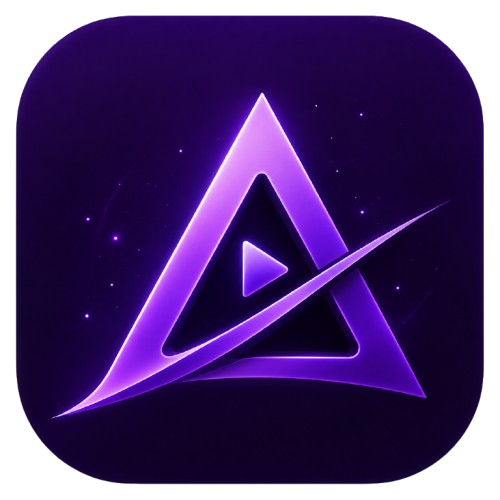
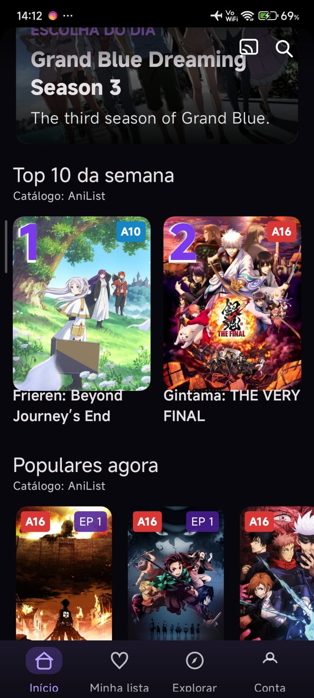
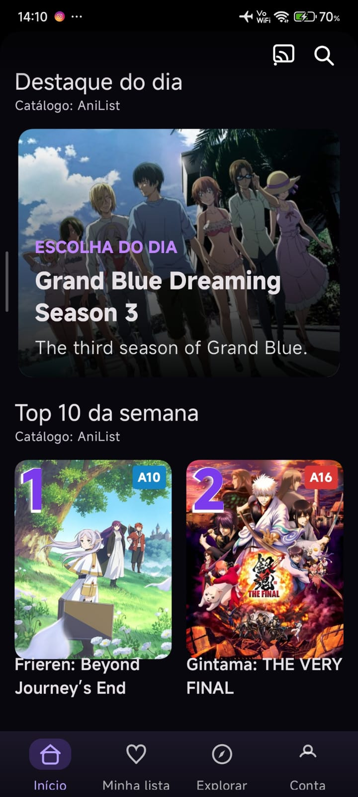
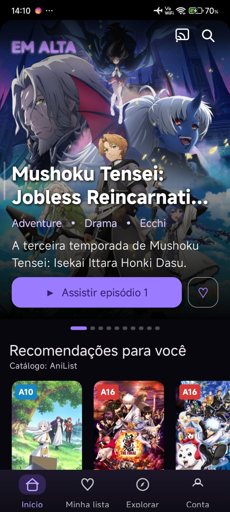
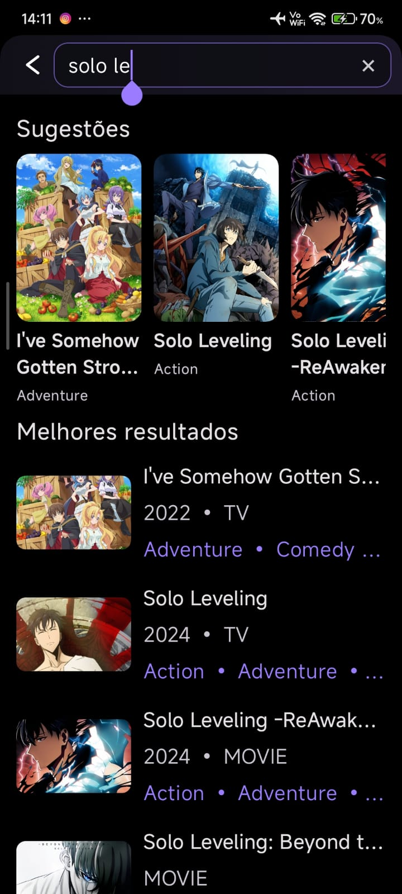
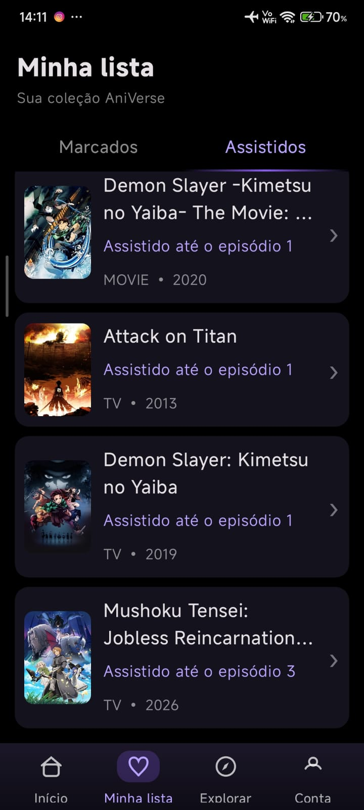
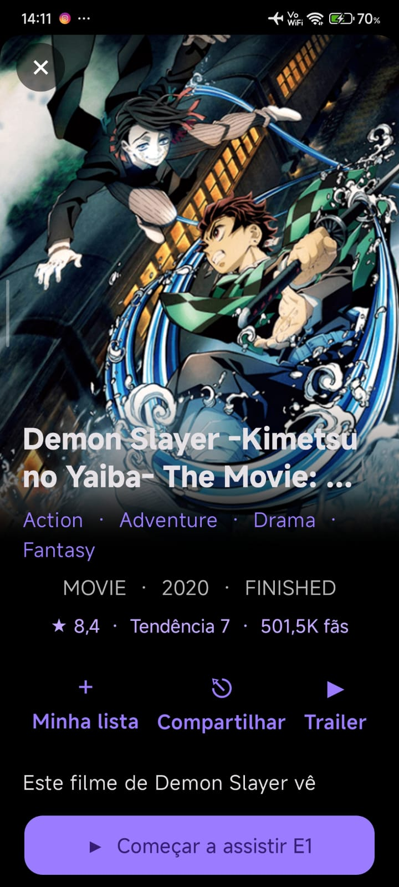
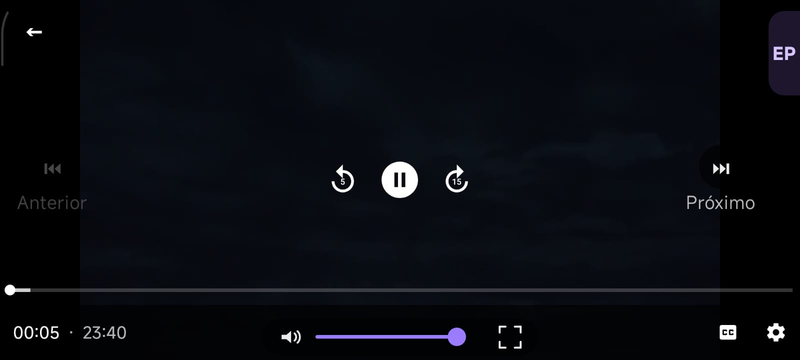
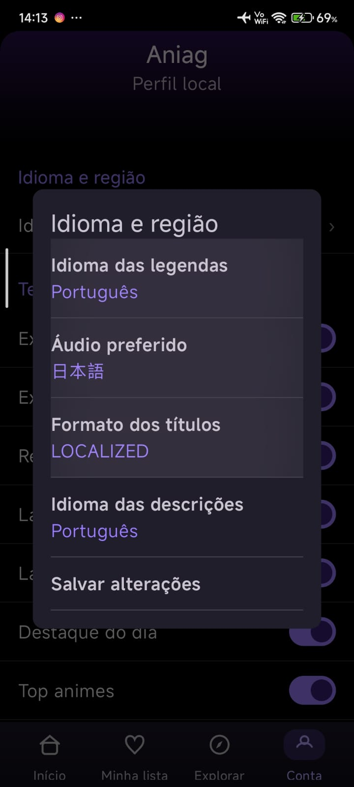
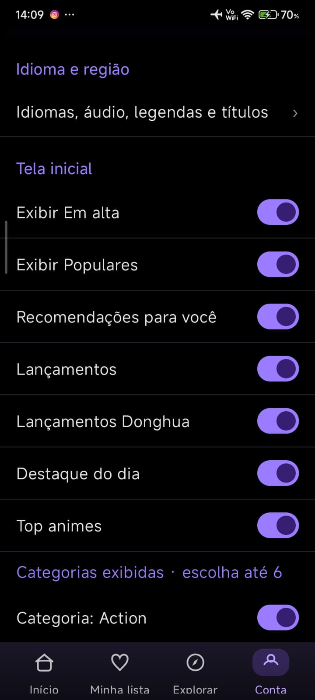

  

  <strong>English</strong> ·
  <a href="README.pt-BR.md">Português</a>

<h1 align="center">AniVerseTV</h1>

  <strong>Your anime universe, right on your Android.</strong> 
  Fresh catalog, native player, custom lists, and AniList sync.

  

  
  
  
  

  <a href="#install">Install</a> ·
  <a href="#features">Features</a> ·
  <a href="#screenshots">Screenshots</a> ·
  <a href="#tech-stack">Tech stack</a> ·
  <a href="#roadmap">Roadmap</a>

---

## About

**AniVerseTV** is a native Kotlin/Jetpack Compose app for discovering, tracking, and watching
anime on Android. It brings together a catalog powered by **AniList**, personal watchlists and
watch-history, smart search, and a player built for binge-friendly navigation.

This repository is the project's showcase only — you'll find information, updates, and the APK
download link here. 

## Features

- **Curated home feed:** "Featured of the day," Top 10 of the week, "Trending," and "Popular now"
  sections, all powered by the AniList catalog.
- **Smart search:** instant suggestions as you type, with poster, year, format (TV/Movie), and
  genres for each title.
- **My List:** separate tabs for **Bookmarked** (plan to watch) and **Watched** titles, with
  per-episode progress tracking.
- **Full detail pages:** synopsis, rating, genres, content rating, year, airing status, and fan
  count, plus quick actions for trailer, share, and adding to My List.
- **Native player:** 5–15s skip forward/back, side episode drawer, per-episode audio language tag
  (e.g. JA-JP), fullscreen, captions, and volume control.
- **Configurable language & region:** subtitle language, preferred audio, title display format
  (localized or original), and description language.
- **Customizable home screen:** toggle sections like Trending, Popular, Recommendations, New
  Releases, Donghua Releases, and pick up to 6 favorite categories.
- **Multiple sources:** episodes are resolved from several providers (such as KickAss and other
  compatible sources), with automatic fallback when a source is unavailable.

## Downloads

| Platform | Version | Codename | Download |
| --- | --- | --- | --- |
| Android Mobile | **0.2.1** | Ne · Ki | [Download APK](https://github.com/AniverseTV/AniverseTV./releases/download/v0.2.1/AniVerseTV-0.2.1-Ne-Ki.apk) |
| Android Mobile | 0.2.0 | Ne · Ki | [Download APK](https://github.com/AniverseTV/AniverseTV./releases/download/v0.2.0/AniVerseTV-0.2.0-Ne-Ki.apk) |
| Android Mobile | 0.1.2 | Ne · Ki | [Download APK](https://github.com/AniverseTV/AniverseTV./releases/download/v0.1.2/AniVerseTV-0.1.2-Ne-Ki.apk) |
| Android Mobile | 0.1.1 | Legacy | [Download APK](https://github.com/AniverseTV/AniverseTV./releases/download/v0.1.1/AniVerseTV-v0.1.1.apk) |
| Android Mobile | 0.1.0 | Legacy | [Download APK](https://github.com/AniverseTV/AniverseTV./releases/download/v0.1.0/AniVerseTV.apk) |
| Android TV | Future release | — | In development |
| Google TV | Future release | — | Planned |
| Fire TV | Future release | — | Planned |

Use the latest Mobile build unless you need an older version for compatibility testing. TV packages will receive separate download buttons when official builds are available.

## Install

1. Download the latest APK from the button below, or from the [Releases](https://github.com/AniverseTV/AniverseTV./releases/latest) tab.
2. Open the `AniVerseTV-0.2.1-Ne-Ki.apk` file. If Android asks, allow installs from unknown sources for the
   app you used to download it (browser or file manager).
3. Open AniVerseTV and start exploring — no account required.

  

**Compatibility:** Android 8.0 (API 26) or newer.

## Screenshots

<table>
  <tr>
    <th width="33%">Home</th>
    <th width="33%">Featured of the day</th>
    <th width="33%">Trending</th>
  </tr>
  <tr>
    <td></td>
    <td></td>
    <td></td>
  </tr>
</table>

<table>
  <tr>
    <th width="33%">Search</th>
    <th width="33%">My List</th>
    <th width="33%">Title details</th>
  </tr>
  <tr>
    <td></td>
    <td></td>
    <td></td>
  </tr>
</table>

  <strong>Native player with episode drawer, skip controls, and fullscreen</strong>  
  

<table>
  <tr>
    <th width="50%">Language, audio & subtitles</th>
    <th width="50%">Home screen customization</th>
  </tr>
  <tr>
    <td></td>
    <td></td>
  </tr>
</table>

## Tech stack

- **Kotlin** with **Jetpack Compose** for the entire UI.
- **Navigation Compose** for screen navigation.
- **Compose for TV** (`tv-foundation` / `tv-material`) already wired into the project, laying the
  groundwork for the upcoming TV build.
- Layered architecture (**presentation**, **domain**, **data**) to make the catalog, player, and
  source integrations easier to evolve.

## Servers and content sources

AniVerseTV doesn't host any video content. Episodes are resolved in real time from third-party
providers (such as KickAss and other compatible sources), with automatic selection of the best
available server for each episode. Availability may vary by title, language, region, and
provider uptime.

Catalog metadata (synopses, ratings, genres, artwork, and airing status) is synced from
**AniList**.

## Roadmap

- [x] **Multilingual interface** with downloadable language models.
- [ ] **TV version** release (Android TV / Fire TV), building on the Compose for TV foundation
      already in place.
- [x] Mobile version (available for download on this page).

## Community & support

Join the [official AniVerseTV Discord community](https://discord.gg/qZw8TmVJx) for announcements, release notes, English and Portuguese discussions, support, suggestions, and bug reports.

Found a bug or have a suggestion? Open an [issue on GitHub](https://github.com/AniverseTV/AniverseTV./issues/new)
describing the expected behavior, what happened, and, if possible, your device model and Android
version.

## Disclaimer

AniVerseTV is a personal and educational project. It is not affiliated with AniList,
MyAnimeList, or any streaming provider. The app hosts no video content; streams are resolved
from third-party providers at playback time. Availability and legality can vary by region, and
users are responsible for following the laws and terms that apply to them.
